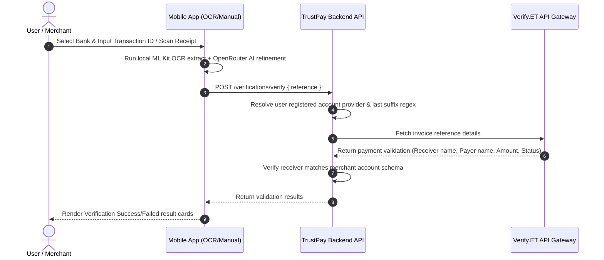

# 🛡️ TrustPay — P2P Merchant Payment Verification Hub

TrustPay is a state-of-the-art Ethiopian payment verification service and mobile dashboard built for merchants. It streamlines P2P verification of transaction logs from banks like **CBE (Commercial Bank of Ethiopia)**, **Telebirr**, **CBE Birr**, **M-Pesa**, **BOA (Bank of Abyssinia)**, and others, combining automated backend settlement with frontend OCR receipt scanning and subscription access control.

---

## 🚀 Key Features

* **🤖 Unified Provider-Agnostic AI Architecture (`AIOrganizer`)**: A single, clean API orchestrating all document extraction, insights generation, auditing, and anomaly detection. UI components never access inference libraries directly.
* **📱 Desktop Web Offline Inference**: In-browser local model execution via custom `GemmaProvider` and off-thread Web Workers, powered by IndexedDB resource caching.
* **📱 Mobile Native AI Edge**: On-device native execution via `react-native-executorch` utilizing local `LLAMA-3.2-1B` models, managed by an Expo-compatible `ResourceFetcher`.
* **🛡️ Graceful Heuristic Fallbacks**: In case models are still downloading, loading, or unsupported, all components fail-soft to specialized local heuristics that parse Ethiopian financial layouts (CBE, Telebirr, BOA, CBE Birr, Dashen, Awash, M-Pesa).
* **⚙️ Automated Settlement Processing**: Verify payment logs using **Verify.ET** API. Validates that the provider, transaction ID, bank account suffixes match database records automatically.
* **💳 Yearly/Monthly Subscription Blocking Modal**: Enforces a yearly (1000 ETB) or monthly (100 ETB) access subscription with blocking checkout paywall modals.
* **🔒 SMTP Password Recovery**: Fully functional forgot-password wizard using email OTP codes powered by **Brevo (Sendinblue) SMTP** and Nodemailer with time-based TTL index security.
* **📊 Dashboard & Log Inspecting**: Interactive dashboard showing recent verifications, detailed history logs, and dynamic detail screens exposing verification states, payer name, and raw API response payload inspector.
* **🌙 Adaptive Dark Mode**: High-fidelity dark mode designed using NativeWind Tailwind tokens and React Navigation theme provider synchronization.

---

## 🛠️ Technology Stack

| Platform / Layer | Technologies Used |
| :--- | :--- |
| **Common AI API** | `AIOrganizer`, Zod-Validated Parsers (Receipts, Insights, Audits) |
| **Mobile Client** | React Native, Expo (SDK 55), Expo Router, TailwindCSS (NativeWind v4), React Query (TanStack), Zustand, `react-native-executorch`, `react-native-executorch-expo-resource-fetcher` |
| **Web Client** | React (v19), Vite (v8), TailwindCSS (v4), React Query, Zustand, `idb` Caching, Comlink Web Workers |
| **Backend API** | Node.js, Express, TypeScript, MongoDB, Mongoose, Nodemailer, Axios |
| **Integrations** | Verify.ET, Brevo (SMTP Host) |

---

## 📂 Project Architecture

```text
                        Shared AI API (AIOrganizer)
                                     │
             ┌───────────────────────┴───────────────────────┐
             ▼                                               ▼
        Web (React)                                    Mobile (Expo)
             │                                               │
    ┌────────┴────────┐                             ┌────────┴────────┐
    ▼                 ▼                             ▼                 ▼
GemmaProvider    CloudProvider                 ExecuTorch       Heuristic Fallback
(Local Edge)     (REST API)                    (Llama 3.2)
    │
OCR → Pipeline → Zod Parser                     OCR → Pipeline → Zod Parser
```

```
trust-pay/
├── backend/
│   ├── src/
│   │   ├── api/
│   │   │   ├── controllers/      # Auth, subscription, verification logic
│   │   │   ├── routes/           # REST endpoints
│   │   │   └── validators/       # Request schemas (Zod)
│   │   ├── config/               # Database connection & environment loader
│   │   Model files/              # User, Verification, Subscription, Otp (Mongoose)
│   │   Services/                 # Verify.ET API client, SMTP email service
│   │   └── server.ts             # Express application lifecycles
│   └── package.json
│
├── frontend/                     # Desktop Web Dashboard Client
│   ├── src/
│   │   ├── ai/                   # Unified AI Platform
│   │   │   ├── providers/        # Gemma, Cloud, and Mock AI providers
│   │   │   ├── runtime/          # Gemma in-browser runtime & db caches
│   │   │   ├── types/            # Zod validation schemas
│   │   │   └── AIOrganizer.ts    # Main orchestrator instance
│   │   ├── pages/                # Analytics, Audit, Verifications dashboard
│   │   └── main.tsx              # Web app entry with context provider
│   └── package.json
│
└── mobile/                       # Native Merchant App
    ├── app/
    │   ├── (auth)/               # LoginStack, OTP recovery stacks
    │   ├── (tabs)/               # Dashboard tabs, history logs, OCR/Manual entry
    │   └── _layout.tsx           # App routing, hydration provider
    ├── src/
    │   ├── ai/                   # Mobile AI client (ExecuTorch hooks wrapper)
    │   │   ├── AIProvider.tsx    # Native ExecuTorch hook hosting context
    │   │   └── AIOrganizer.ts    # Shared parser & mapper layouts
    │   ├── components/           # Subscriptions & status widgets
    │   └── store/                # Zustand client state (authStore)
```

---

## 🏁 Getting Started

### 🖥️ 1. Backend Service Configuration

1. Navigate to the backend directory:
   ```bash
   cd backend
   ```
2. Install standard dependencies:
   ```bash
   npm install
   ```
3. Set up your environment variables by creating `.env` in the backend root folder:
   ```env
   PORT=5000
   NODE_ENV=development
   MONGODB_URI=mongodb://localhost:27017/trustpay
   JWT_SECRET=your_jwt_signing_secret_key
   
   # Verify.ET Details
   VERIFYET_API_KEY=your_verify_et_api_token
   
   # SMTP Email Config (Brevo)
   SMTP_HOST=smtp.brevo.com
   SMTP_PORT=587
   SMTP_USER=your_brevo_smtp_user_email
   SMTP_PASS=your_brevo_smtp_access_password
   SENDER_EMAIL=noreply@trustpay.com
   ```
4. Start the backend watch server:
   ```bash
   npm run dev
   ```

### 📱 2. Mobile App Configuration

1. Navigate to the mobile app directory:
   ```bash
   cd ../mobile
   ```
2. Install standard dependencies:
   ```bash
   npm install
   ```
3. Setup the local environment variables in the mobile root directory:
   Create `.env` (or copy `.env.example` if available):
   ```env
   EXPO_PUBLIC_API_URL=http://localhost:5000/api/v1
   EXPO_PUBLIC_OPEN_ROUTER_API_KEY=your_open_router_mistral_api_key
   ```
4. Launch the Expo framework:
   ```bash
   npx expo start
   ```

---

## 🧪 Testing & Linting

### Type Safety Checks
* Verify backend types:
  ```bash
  cd backend && npm run typecheck
  ```
* Verify mobile types:
  ```bash
  cd mobile && npx tsc --noEmit
  ```

---

## 📈 verification flow Details



---

## 📜 License
This project is private and proprietary. All Rights Reserved. Created by **NY-Development**.
